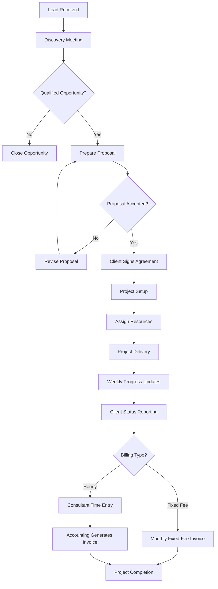
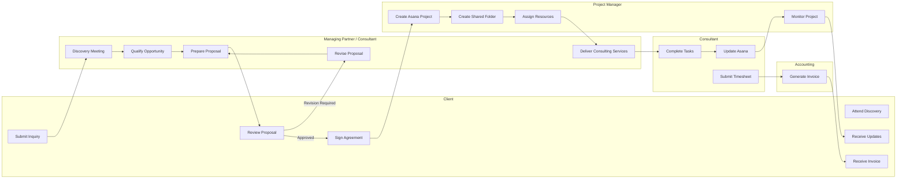
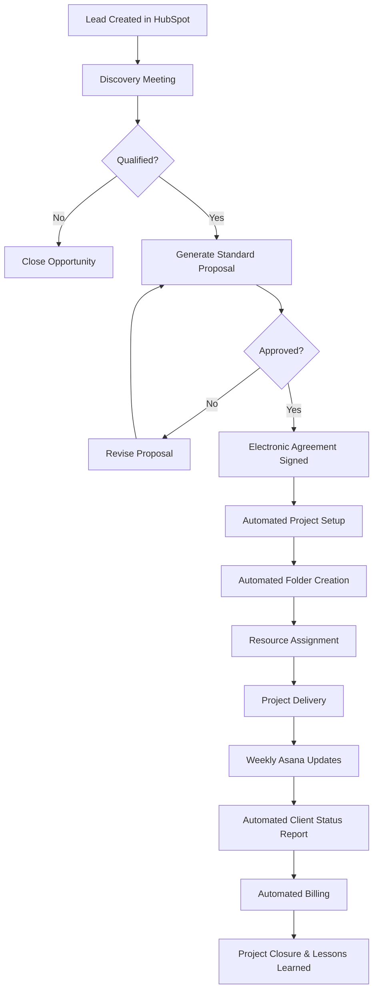

# Workflow Diagram

**Assessment:** AI Process Consultant Assessment

**Prepared By:** Vaishnavi Gaurkar

---

# Overview

This document represents the **current-state ("As-Is") workflow** of the consulting firm's client delivery process based on the discovery session with the Managing Partner.

The workflow begins with lead generation and concludes with project completion and billing. It includes the primary activities, decision points, stakeholders, systems used, and known process exceptions.

> **Note:** The workflow reflects the information gathered during the initial discovery interview. Where information was unavailable, assumptions have not been made.

---

# High-Level Process Flow

---

# Swimlane Workflow

---

# Workflow Steps

| Step | Activity | Owner | System |
|------|----------|--------|---------|
| 1 | Receive client inquiry | Managing Partner / Consultant | Email, Website, LinkedIn |
| 2 | Conduct discovery meeting | Managing Partner / Consultant | Meeting |
| 3 | Determine project fit | Managing Partner | Manual Decision |
| 4 | Prepare proposal | Managing Partner / Senior Consultant | Proposal Template |
| 5 | Client reviews proposal | Client | Email |
| 6 | Client signs agreement | Client | Agreement |
| 7 | Create project | Project Manager | Asana |
| 8 | Create shared folder | Project Manager | Google Drive |
| 9 | Assign consultants | Project Manager | Capacity Spreadsheet |
| 10 | Deliver project | Consultant | Asana |
| 11 | Update progress | Consultant | Asana |
| 12 | Client reporting | Project Manager / Consultant | Meetings, Reports |
| 13 | Submit time entries (Hourly) | Consultant | Timesheet |
| 14 | Generate invoice | Accounting | Accounting System |
| 15 | Close project | Project Team | Asana |

---

# Decision Points

The workflow contains several important decision points.

| Decision | If Yes | If No |
|-----------|--------|--------|
| Is the opportunity qualified? | Create proposal | Close opportunity |
| Has the client accepted the proposal? | Sign agreement | Revise proposal |
| Has the agreement been signed? | Begin project setup | Wait for signature |
| Is the project fixed-fee? | Monthly invoice | Collect timesheets before invoicing |

---

# Systems Used Throughout the Workflow

| System | Purpose |
|----------|----------|
| HubSpot | Lead Management |
| Asana | Project Management |
| Google Drive | Document Repository |
| Slack | Internal Communication |
| Email | Client Communication |
| Capacity Spreadsheet | Resource Planning |

---

# Known Process Exceptions

The discovery interview identified several deviations from the intended workflow.

| Intended Process | Actual Practice | Business Risk |
|------------------|----------------|---------------|
| Every lead entered into HubSpot | Referral leads may bypass HubSpot | Reduced sales visibility |
| Standard proposal template | Consultants use different formats | Inconsistent proposals |
| Project setup completed before delivery | Work may begin early | Governance issues |
| PM assigns resources | Managing Partner may assign directly | Resource conflicts |
| Weekly updates recorded in Asana | Some updates shared through Slack or Email | Multiple sources of truth |
| Documentation stored centrally | Files stored in multiple locations | Knowledge fragmentation |
| Timesheets submitted on time | Late submissions delay billing | Cash flow delays |

---

# Current-State Workflow Summary

The current workflow is functional and supports the end-to-end client engagement lifecycle. However, several process variations reduce consistency and operational visibility.

The primary challenges include:

- Inconsistent use of business systems
- Manual resource planning
- Multiple communication channels
- Lack of standardized documentation
- Variations in proposal creation
- Delayed billing due to late time entries

These observations indicate that the organization would benefit from standardized operating procedures, stronger governance, and greater automation.

---

# Future-State Workflow (Recommended)

The future-state workflow introduces standardization, mandatory process controls, and automation to improve consistency and scalability.

---

# Future-State Benefits

| Improvement | Expected Benefit |
|-------------|------------------|
| Mandatory HubSpot lead creation | Complete sales visibility |
| Standard proposal template | Consistent client experience |
| Automated project setup | Reduced manual effort |
| Centralized documentation | Single source of truth |
| Standard Asana updates | Improved project visibility |
| Automated billing reminders | Faster invoicing |
| Standard project closure | Better knowledge retention |

---

# Conclusion

The current workflow provides a solid foundation for managing consulting engagements but relies heavily on individual practices and manual coordination. Standardizing key activities, strengthening governance, and introducing automation will improve consistency, operational visibility, and scalability while reducing administrative effort.
